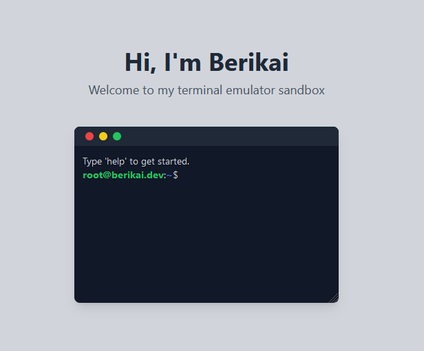

# Berikai's Terminal Emulator Sandbox

This is a terminal emulator sandbox, made as a personal funny website project. Written with Typescript, Preact, Vite, Tailwind.

## Features

All available commands:

- sudo: Run commands as superuser

- help: List all available commands (opts: --hidden)

- about: About me

- portfolio: View my portfolio

- socials: Social media links

- music: Listen to my music

- terminal: Open a new terminal window ( + key)

- exit: Exit the terminal ( - key)

- clear: Clear the console

- kill: Kill the process with the given ID

- list: List all open processes

- id: Shows the process ID of the current terminal window

- chgid: Change the process ID of the current terminal window (0 = main terminal window)

- echo: Echo the given text

- neofetch: Show system information

- ableton: Open Ableton Live

- code: Open this project in VS Code

- reboot: Reboot the system

- poweroff: Shutdown the system

- rm: Remove files or directories

... and much more to come.